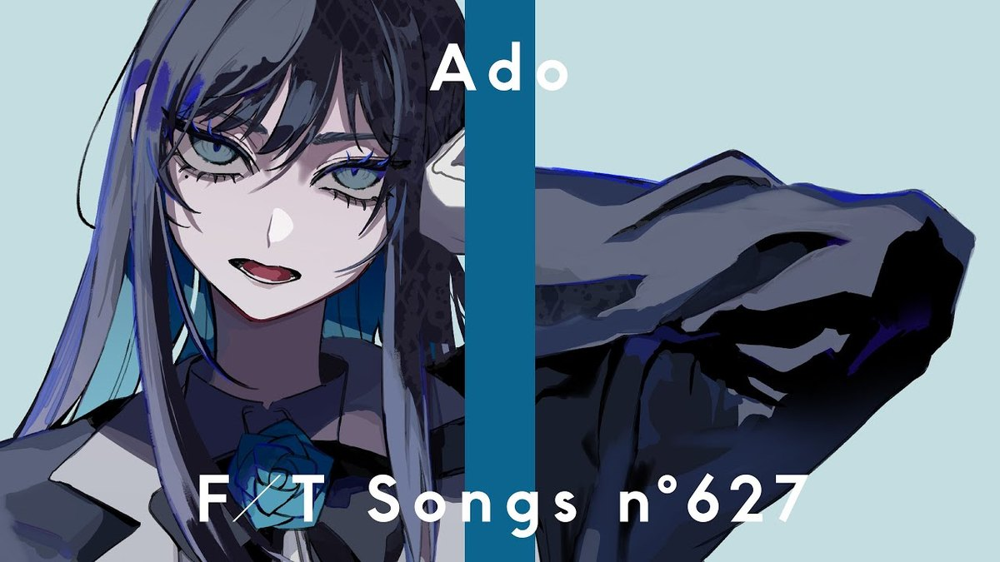
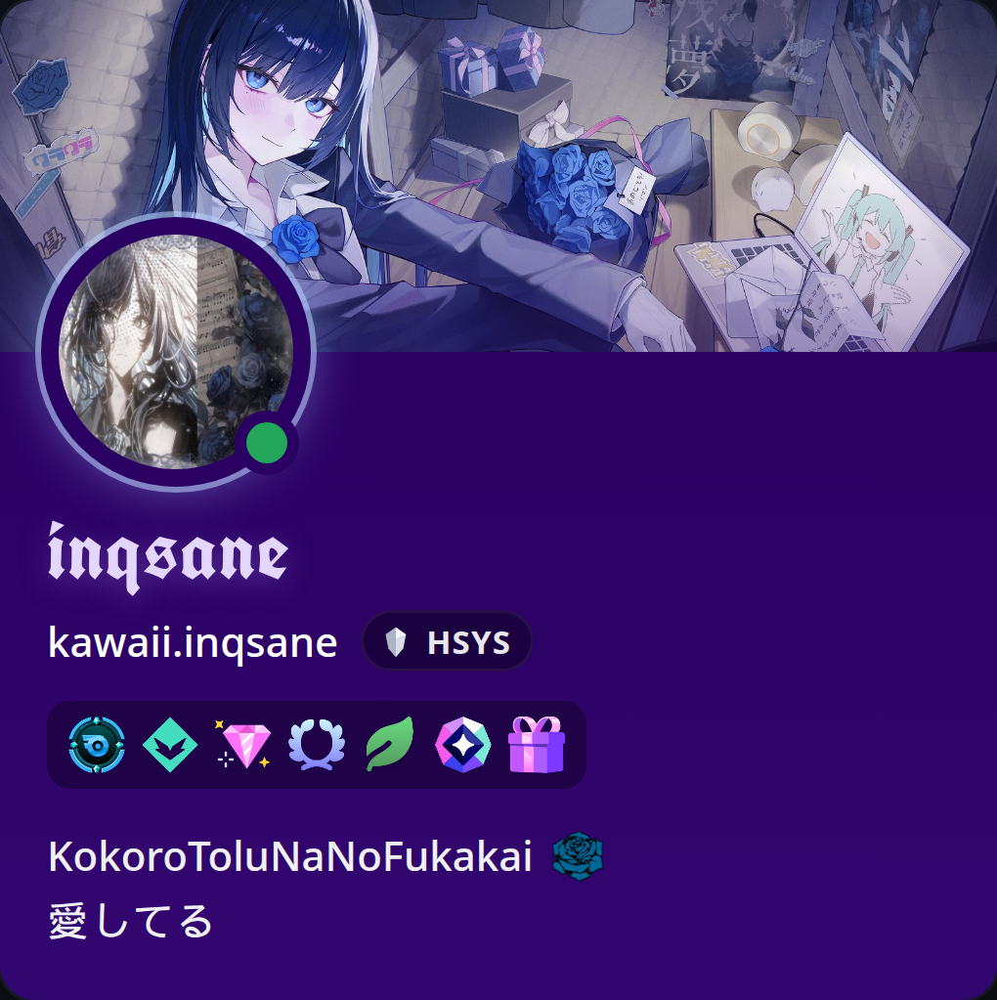
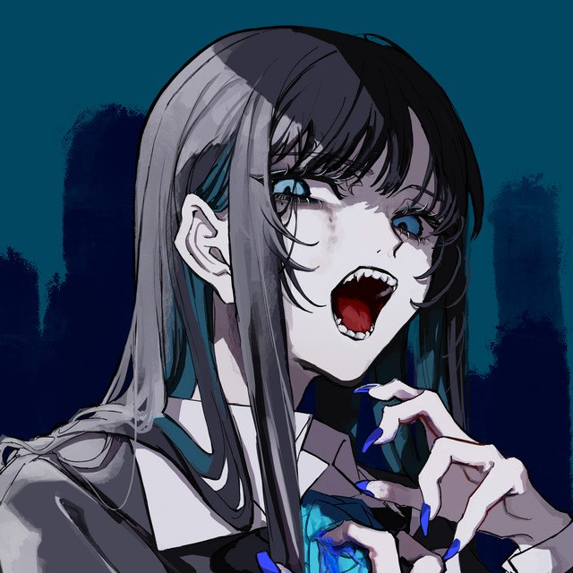
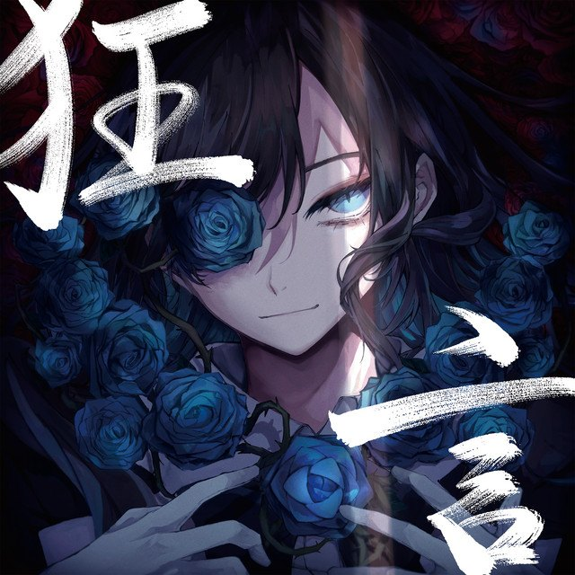
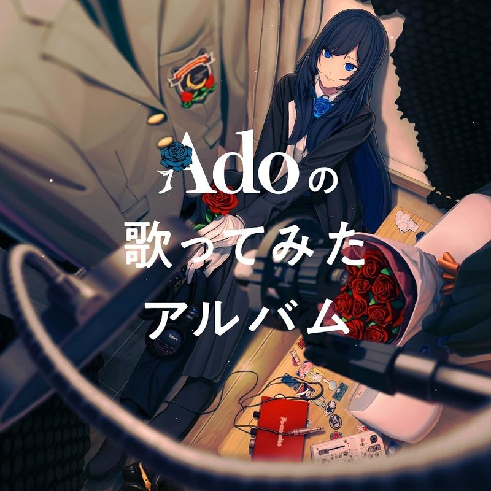
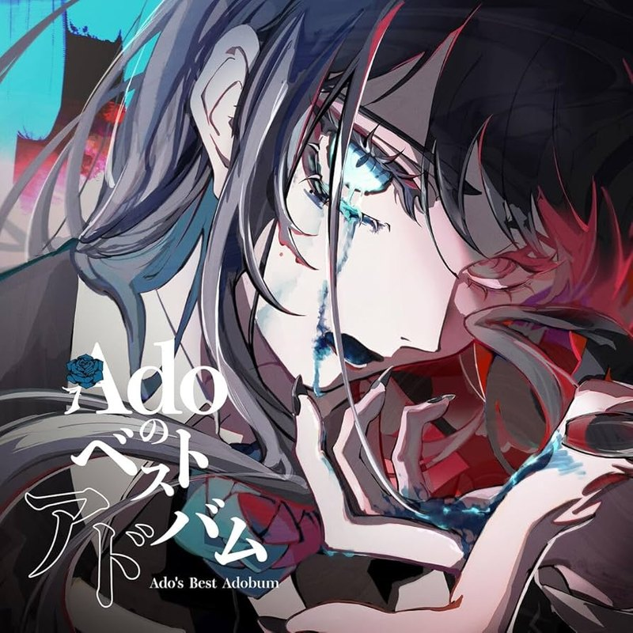

  

  

<h1 align="center">inqsane</h1>

  <em>インクセイン</em>

  Contact me via <a href="mailto:inqsane@inqsane.eu">inqsane@inqsane.eu</a>
  · <a href="https://inqsane.eu">inqsane.eu</a>
   I currently work for HES (Hydroeletric Simulator) as the Head of Systems.

  

  <strong>Ado</strong>

  
  
  
  

  

  
  
  
  
  
  
  

